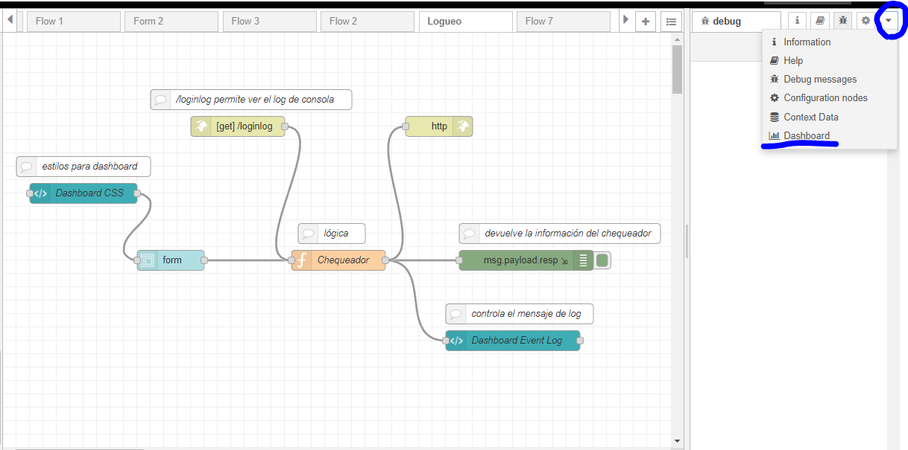
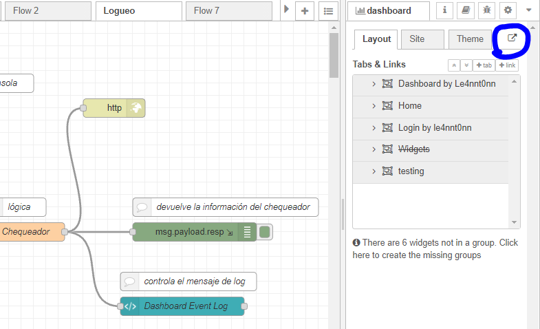
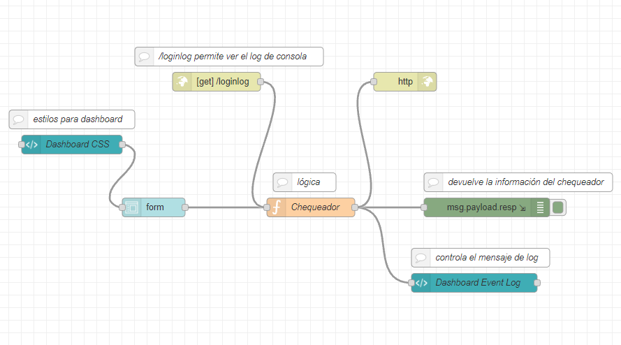
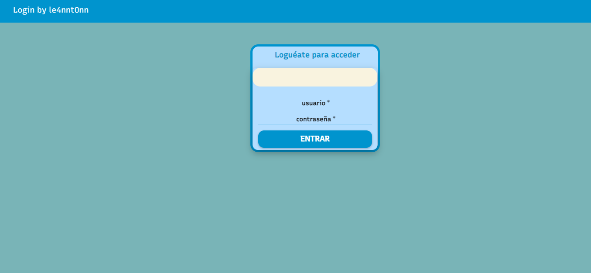
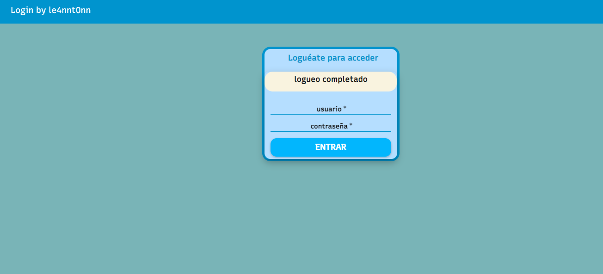
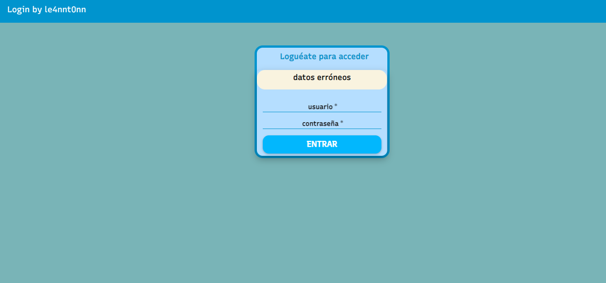
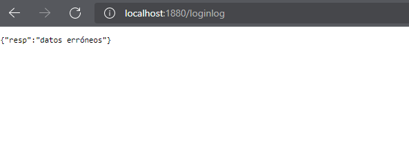

## Tarea en NodeRED

> Fecha de entrega ➡️ 08-10-2021

### 🧠 ¿De qué trata?

Campo de logueo con interfaz Dashboard de NodeRED.

El usuario a introducir es **antonio** y la contraseña **dwes**.

### 📝 Características

* Lógica de login
* Uso de CSS para la interfaz
* Campos de usuario y contraseña
* Botón para entrar
* Si escribes en la barra http://localhost:1880/loginlog puedes ver el log del login
---

### ❓ Cómo abrir ventana Dashboard

`Es importante realizar este paso para poder ver la interfaz gráfica de login.`

### 👁️ Imágenes

#### ✅ Datos correctos

#### ❌ Datos incorrectos

#### Respuesta en log

